# 🚀 Azure SQL Database CI/CD Pipeline using Terraform, Flyway & Azure DevOps

## 📌 Project Overview

This project demonstrates an enterprise-style **Database DevOps CI/CD pipeline** for **Azure SQL Database**, integrating:

* **Terraform** for Infrastructure as Code (IaC)
* **Flyway** for database schema versioning and migrations
* **Azure DevOps Pipelines** for CI/CD automation
* **GitHub Repositories & Pull Requests** for source control and validation-driven deployments

The solution simulates a modern cloud-native database deployment workflow with:

* Automated Azure infrastructure provisioning
* Database schema migration automation
* Pull Request validation before merge
* Multi-environment deployments (DEV & TEST)
* Manual approval gates before TEST deployment
* Secure secret management using Azure DevOps Library Variable Groups
* Automated cleanup/destroy pipeline for infrastructure lifecycle management

---

# 🏗️ Solution Architecture

## Core Components

| Component          | Purpose                                     |
| ------------------ | ------------------------------------------- |
| Terraform          | Provision Azure SQL infrastructure          |
| Flyway             | Manage versioned database schema migrations |
| Azure DevOps       | Automate CI/CD workflows                    |
| GitHub PR Workflow | Enable validation before merge              |
| Azure SQL Database | Cloud-hosted relational database            |
| Variable Groups    | Secure environment-specific configuration   |

---

# 🖼️ Architecture Diagram

## End-to-End CI/CD & Infrastructure Workflow

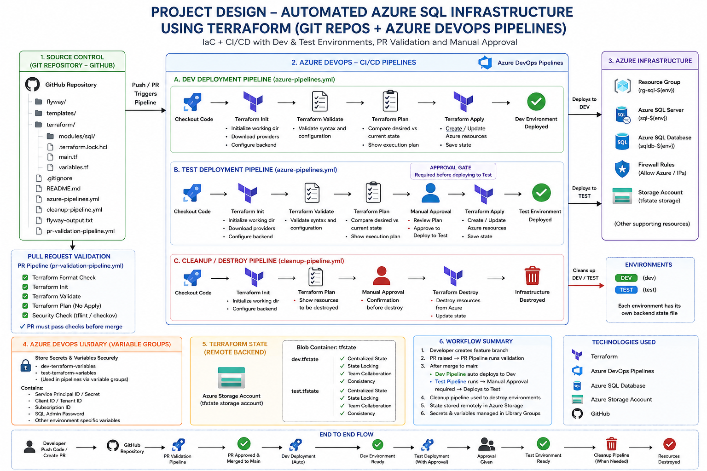

### Workflow Summary

1. Developer pushes code or raises Pull Request in GitHub
2. PR Validation Pipeline runs Terraform & Flyway validation checks
3. After merge to main:
   - DEV deployment runs automatically
4. Manual approval is required before TEST deployment
5. Terraform provisions Azure SQL infrastructure
6. Flyway executes database schema migrations
7. Terraform state is stored remotely in Azure Storage Account
8. Secrets and environment variables are managed through Azure DevOps Library Variable Groups
9. Cleanup pipeline can safely destroy DEV/TEST resources when required


# 🔄 CI/CD Workflow

## Pull Request Validation Flow

```text
Feature Branch
    ↓
Pull Request to main
    ↓
PR Validation Pipeline Triggered
    ↓
Terraform Format Check
Terraform Validate
Terraform Plan
Flyway Validate
Security Checks
    ↓
PR Approval & Merge
```

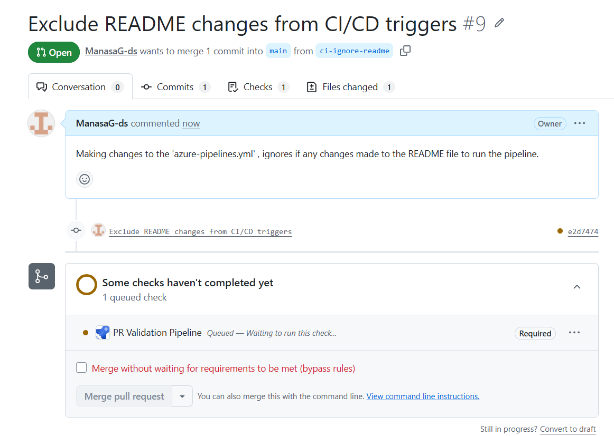
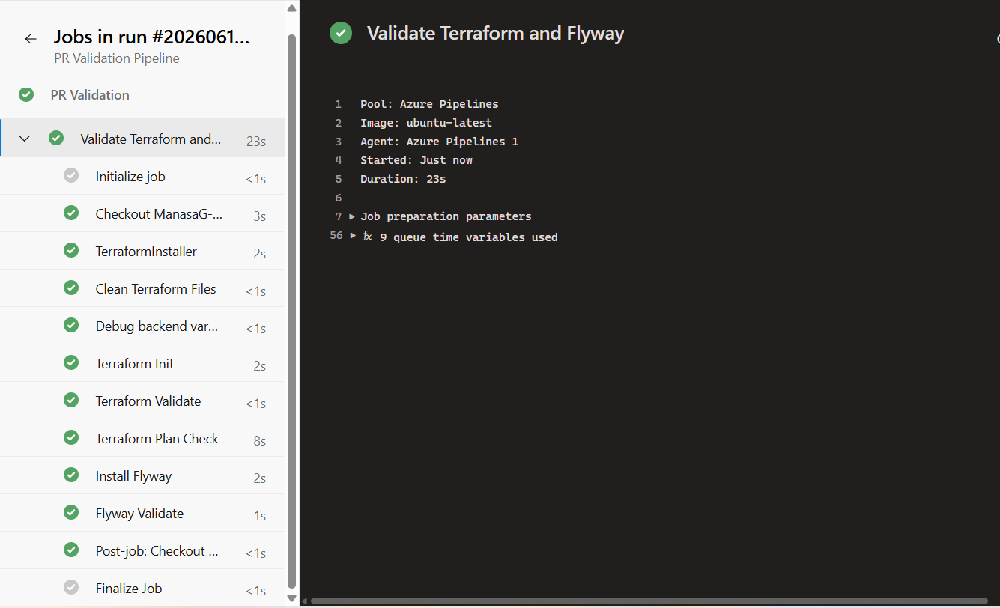
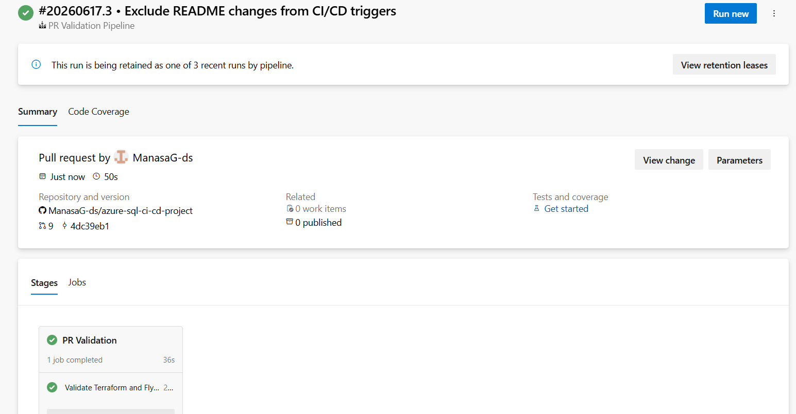
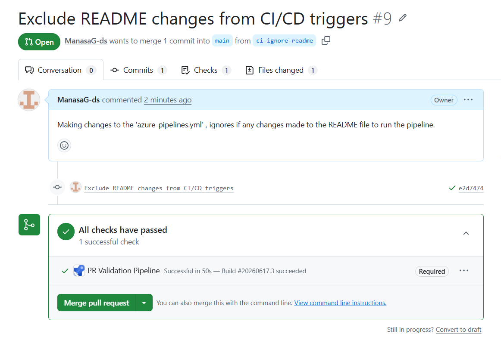
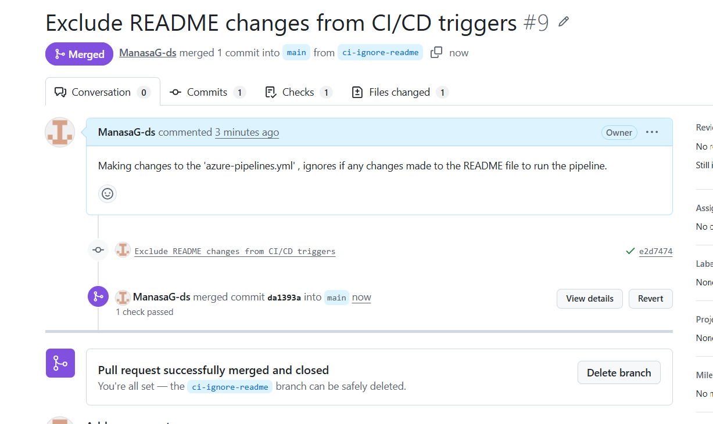


## Deployment Flow

```text
Merge to main
    ↓
DEV Deployment Pipeline
    ↓
Terraform Init
Terraform Validate
Terraform Plan
Terraform Apply
Flyway Migration
    ↓
DEV Environment Ready
    ↓
Manual Approval Gate
    ↓
TEST Deployment Pipeline
    ↓
Terraform Apply
Flyway Migration
    ↓
TEST Environment Ready
```

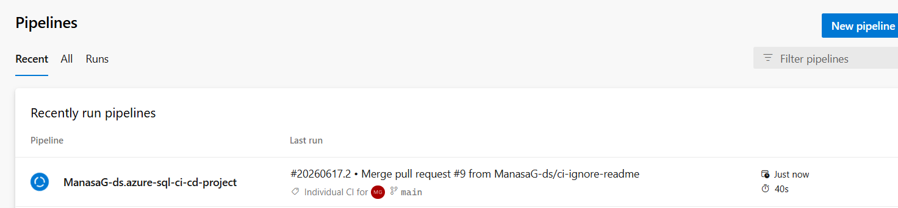

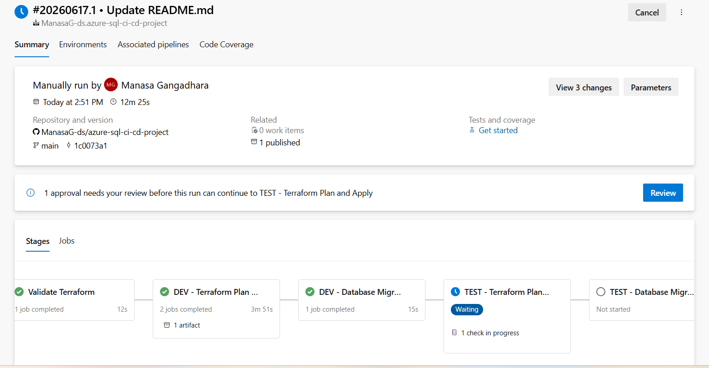

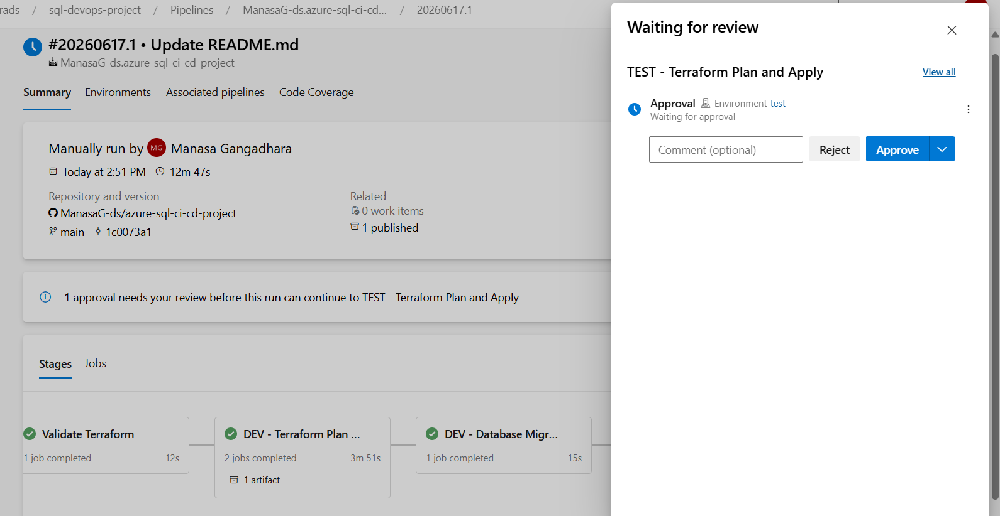

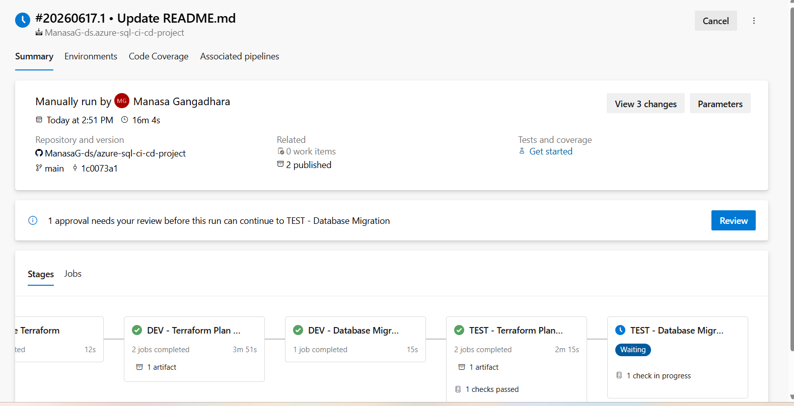

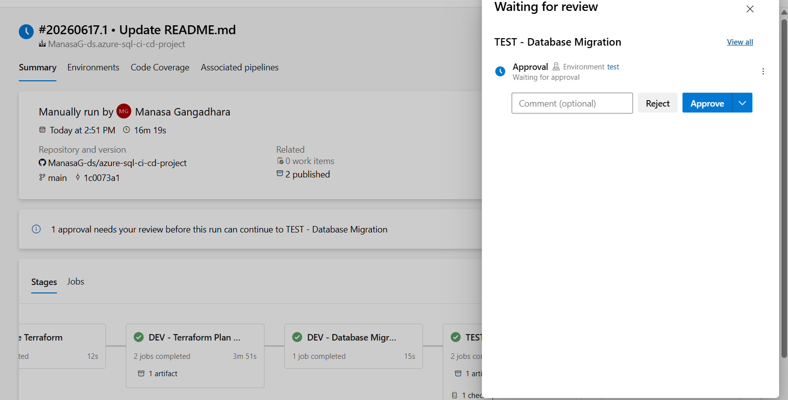

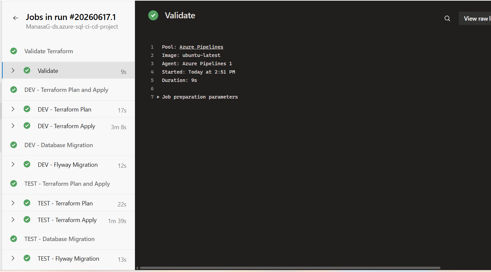

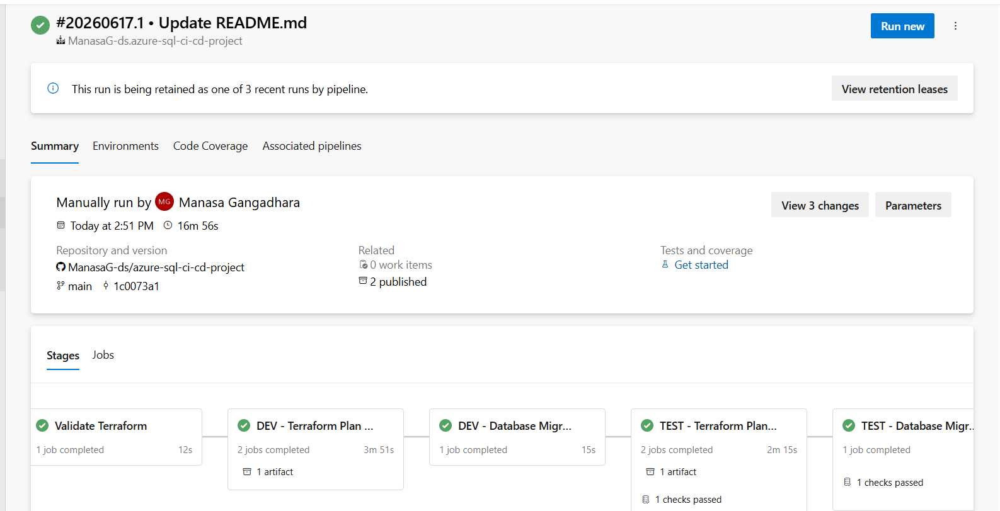

## Cleanup/ Destroy Flow

```text
Cleanup Pipeline Triggered
    ↓
Terraform Init
    ↓
Terraform Plan (Destroy)
    ↓
Manual Approval
    ↓
Terraform Destroy
    ↓
Resources Removed
```

---

# ✅ Features Implemented

## 🏗️ Infrastructure as Code (Terraform)

Implemented modular Terraform-based Azure infrastructure deployment:

* Azure SQL Server provisioning
* Azure SQL Database creation
* Firewall rule configuration
* Reusable Terraform module structure
* Environment-based Terraform state separation
* Parameterized infrastructure deployment using pipeline variables

### Terraform Highlights

* Reusable Terraform templates
* Separate Terraform state files for DEV and TEST
* Shared SQL Server with environment-specific databases
* Environment-driven configuration through Azure DevOps variable groups

---
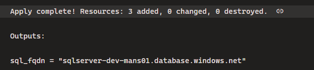

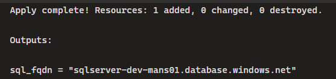

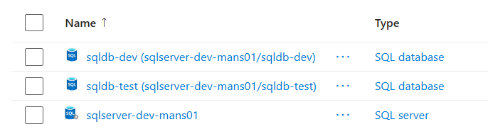


## 🧱 Database Migration Management (Flyway)

Implemented Flyway-based database schema version control and deployment automation.

### Implemented Migration Features

* Versioned migration scripts
* Automated schema deployment
* Database initialization scripts
* Seed/reference data management
* Migration validation during PR checks
* Environment-specific migration execution

### Example Migration Activities

* Table creation
* Schema updates
* Seed/reference data insertion

---

## 🔄 Azure DevOps CI/CD Pipeline

Built a reusable multi-stage YAML pipeline architecture.

### Pipeline Capabilities

* Terraform validation
* Terraform planning
* Infrastructure deployment
* Automated Flyway migrations
* Reusable YAML templates
* DEV and TEST environment deployments
* Environment-specific variable groups
* Pull Request validation workflow

### Template-Based Pipeline Design

Reusable pipeline templates were implemented to reduce duplication and standardize deployments across environments.

---

## 🔀 Pull Request Validation Workflow

Implemented a GitHub Pull Request validation model integrated with Azure DevOps pipelines.

### PR Validation Checks

The Pull Request validation pipeline ensures infrastructure and database changes are validated before merge.

Implemented validations include:

* Terraform format checks
* Terraform validation
* Terraform execution plan
* Flyway migration validation
* Security/static analysis checks
* Merge protection using required pipeline checks

---

# 🧹 Cleanup / Destroy Pipeline

Implemented a separate infrastructure cleanup workflow using Terraform Destroy.

## Cleanup Features

* Separate cleanup pipeline
* Environment selection (DEV / TEST)
* Manual approval before destroy
* Safe infrastructure teardown
* Terraform state synchronization
* Cost optimization for non-production environments

This simulates real-world cloud lifecycle management practices used in enterprise DevOps environments.

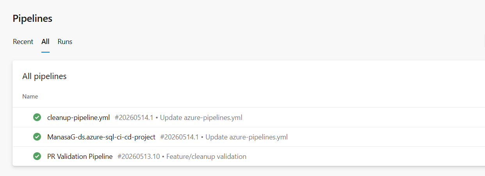

```md


# 🔐 Security & Configuration Management

Implemented foundational DevOps security practices:

* Azure DevOps Library Variable Groups for secrets management
* Environment-specific variable groups for DEV and TEST
* Removed hardcoded credentials from Flyway configuration
* Secure pipeline variable usage
* Parameterized deployment configuration
* Terraform remote backend configuration
* Environment-based secret isolation

### Secrets Managed Securely

* Service Principal Client ID
* Client Secret
* Subscription ID
* Tenant ID
* SQL Administrator Password
* Environment-specific variables

---

# 🌍 Multi-Environment Deployment Strategy

Implemented separate deployment flows for:

| Environment | Purpose |
|---|---|
| DEV | Initial infrastructure provisioning and schema validation |
| TEST | Controlled post-validation deployment testing |

## Environment Deployment Features

* Separate Terraform backend state files for DEV and TEST
* Independent environment configuration
* Manual approval gate before TEST deployment
* Environment-specific Azure DevOps Library Variable Groups
* Shared reusable Terraform modules
* Controlled deployment promotion workflow

---

# 📂 Repository Structure

```text
.
├── flyway/
│   ├── config/
│   └── sql/
│
├── templates/
│   ├── terraform-stage.yml
│   └── flyway-stage.yml
│
├── terraform/
│   ├── modules/
│   │   └── sql/
│   │
│   ├── .terraform.lock.hcl
│   ├── main.tf
│   └── variables.tf
│
├── azure-pipelines.yml
├── cleanup-pipeline.yml
├── pr-validation-pipeline.yml
├── .gitignore
├── README.md
└── flyway-output.txt
```

---

# 🧰 Technologies Used

* Terraform
* Azure SQL Database
* Flyway
* Azure DevOps Pipelines
* GitHub Repositories
* GitHub Pull Requests
* YAML Pipelines
* Microsoft Azure
* Azure Storage Account
* Azure DevOps Library Variable Groups

---

# 🚧 Planned Enhancements

## 🔐 Security Hardening

* Azure Key Vault integration
* Managed Identity authentication
* Role-based access control (RBAC)

## 📊 Observability & Monitoring

* Azure Monitor integration
* Log Analytics integration
* Deployment and migration logging

## 🧪 Advanced Validation

* Automated schema validation tests
* Data integrity verification
* Post-deployment smoke tests

## 🔁 Governance Improvements

* Terraform drift detection
* Automated policy enforcement
* Scheduled infrastructure validation

---

# 🧠 Skills Demonstrated

This project demonstrates practical exposure to:

* Infrastructure as Code (IaC)
* CI/CD automation
* Pull Request validation workflows
* Multi-environment deployment strategy
* Terraform remote state management
* Azure DevOps pipeline orchestration
* Database migration automation
* Secure secrets management
* Approval-based release workflows
* Infrastructure lifecycle management

---

# 🎯 Project Outcome

This project demonstrates a production-style Azure SQL Database CI/CD implementation that combines:

* Infrastructure provisioning
* Database migration automation
* Pull Request validation
* Multi-environment deployment
* Reusable CI/CD templates
* Secure deployment practices

The solution reflects modern enterprise DevOps workflows used for cloud-based database delivery and automation.
